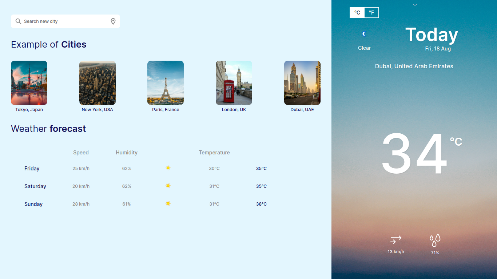

# Weather App

A simple weather web application that allows users to check the weather conditions of different cities.

## Overview

This web application fetches weather data from the WeatherAPI and displays current weather conditions and a 3-day forecast for the selected city. It provides information such as temperature, wind speed, humidity, and weather conditions.

## Features

- Search for weather conditions of different cities.
- Use geolocation to automatically fetch weather data based on your current location.
- Toggle between Celsius and Fahrenheit units for temperature.
- Displays current weather conditions with icons.
- Show a 3-day forecast with detailed information.

## Technologies Used

- HTML5
- CSS3
- JavaScript (ES6)
- Fetch API for data retrieval
- WeatherAPI for weather data

## Getting Started

1. Clone this repository: `git clone <repository_url>`
2. Open `index.html` in your web browser.

## Usage

- Enter a city name in the search input to get the current weather and forecast.
- Click the geolocation button to get weather information based on your current location.
- Click on a city in the cities list to see weather information for that city.
- Toggle between Celsius and Fahrenheit units by clicking on the temperature unit.

## Screenshots

## Credits

- Weather data provided by [WeatherAPI](https://www.weatherapi.com/).
- Background images sourced from [Unsplash](https://unsplash.com/).
